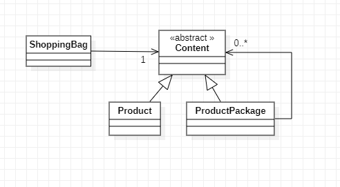

# Padrões de Projeto

## 2. Padrões de Strutural:
___
### 2.7 Composite

#### 2.7.1 Introdução
O Composite é um padrão de projeto estrutural que permite que você componha objetos em estruturas de árvores e então trabalhe com essas estruturas como se elas fossem objetos individuais.

#### 2.7.2 Exemplo abordado
Como exemplo para desmonstração de implementação temos uma sacola de compras 

#### 2.7.3 Diagrama de Classe do Exemplo
